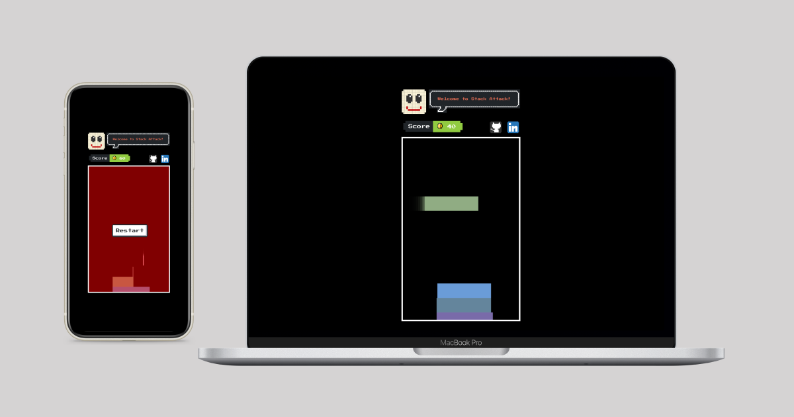

# Stack Game 🎮



A simple Stack Game built using Vanilla JavaScript, styled with the NES.css library, and deployed on Vercel.

## Demo
You can play the game [here](https://stack-attack.vercel.app/) 🎉

## Features
- Simple and addictive gameplay
- Retro style using [NES.css](https://nostalgic-css.github.io/NES.css/)
- Responsive design, playable on mobile and desktop devices
- Score tracking

## Technologies
- **Vanilla JavaScript** for the game logic
- **HTML5 Canvas** for rendering game elements
- **NES.css** for retro 8-bit inspired styling
- **[Vercel](https://vercel.com)** for deployment

## Installation
To run this game locally, follow these steps:

   1- Clone the repository:
   ```bash
   git clone https://github.com/belenyb/stack-attack.git
   ```
   2- Navigate to the project directory:
```bash
cd stack-game
```
3- Open index.html in your browser to play the game locally.

## How to play
- The goal is to stack boxes as precisely as possible.
- Press the spacebar or click/tap to drop the box and land it on the stack. Each stacked box scores 10 points.
- The game gets harder as the speed increases.
